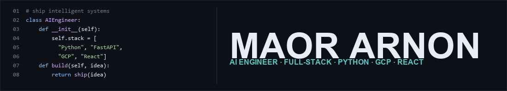

## hey there 

  

  
  
  

  
  &nbsp;
  
  &nbsp;
  
  &nbsp;&nbsp;
  <b>B.Sc. Software Engineering ·</b>
  
  <b>Ashdod · GPA 85</b> 👨🏻‍🎓

My name is [Maor Arnon](https://maor-ar.github.io/), an **AI Engineer** and full-stack developer with ~5 years of professional experience. I currently work at **MGroup** on education-sector products for the **Israeli Ministry of Education**, building production Generative AI systems with **Python, FastAPI, Google Cloud, Vertex AI (Gemini), embeddings, and RAG**.

Before that, I spent several years as a full-stack developer at **Matrix**, shipping enterprise apps for Bank of Israel, Mizrahi-Tefahot, FIBI, Max, and others. I care about clean architecture, solid UX, and code that ships — from agent workflows and MCP tools to polished client websites.

- 🏢 **AI Engineer @ MGroup** — LLM backends, agents, GCP / Vertex AI
- 🌐 Portfolio → [maor-ar.github.io](https://maor-ar.github.io/)
- 💼 Freelance? [maorarnon@gmail.com](mailto:maorarnon@gmail.com)
- 💬 Ask me about AI systems, full-stack, or open source

 

**languages & tools:**

<code></code>
<code></code>
<code></code>
<code></code>
<code></code>
<code></code>
<code></code>
<code></code>
<code></code>
<code></code>
<code></code>
<code></code>
<code></code>
<code></code>
<code></code>

 

`Python` · `FastAPI` · `Vertex AI` · `Gemini` · `RAG` · `Embeddings` · `MCP` · `LangChain` · `React` · `Angular` · `TypeScript` · `.NET` · `GCP` · `Docker` · `SQL`

### :zap: featured projects 

- [**JibToHeb-MCP**](https://github.com/Maor-Ar/JibToHeb-MCP) — Open-source MCP server that fixes English↔Hebrew keyboard gibberish ([PyPI](https://pypi.org/project/jibberish-to-hebrew-mcp/))
- [**StudioBuda-ArtHub**](https://github.com/Maor-Ar/StudioBuda-ArtHub) — Art studio CRM / class registration platform (React Native + full-stack)
- [**YaaraArtStudioClassesSite**](https://github.com/Maor-Ar/YaaraArtStudioClassesSite) — Art classes & workshops site (Angular & SCSS)
- [**Portfolio & client sites**](https://maor-ar.github.io/) — Personal site plus client landing pages hosted on GitHub Pages
- [**RecycleCan**](https://github.com/Maor-Ar/RecycleCan) — Smart recycling bin (Arduino + Android)
- [**Elbars-Assignment**](https://github.com/Maor-Ar/Elbars-Assignment) — Product management system (.NET Core + Angular + MS-SQL)

### experience snapshot

| Role | Org | Focus |
| --- | --- | --- |
| AI Engineer | MGroup · Ministry of Education | LLM APIs, RAG, Vertex AI / Gemini, GCP, FastAPI |
| Full-stack Developer | Matrix · banking clients | Angular, .NET, SQL — Bank of Israel, Mizrahi-Tefahot, FIBI, Max |

## **Recent Activity**
<!--START_SECTION:activity-->
1. ❗️ Opened issue [#1](https://github.com/MatanSofer/FooDatingApp-AndroidProject/issues/1) in [MatanSofer/FooDatingApp-AndroidProject](https://github.com/MatanSofer/FooDatingApp-AndroidProject)
<!--END_SECTION:activity-->

---
## 📊 tasks

- [x] Born
- [x] Got a job
- [ ] Married
- [ ] Have children
- [ ] Die

---

If you like what I do,  
maybe consider buying me a coffee/tea 🥺👉👈

---

### 📈 GitHub stats

### 🙊 A random joke to lighten up your day

